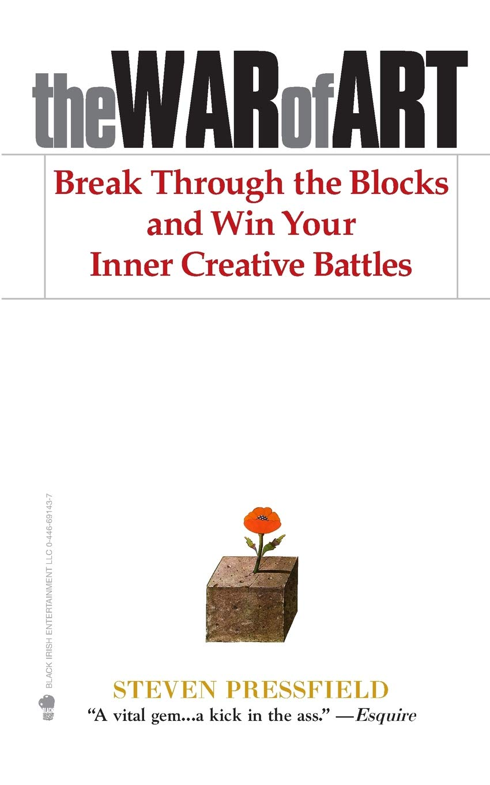

[War of Art](https://www.amazon.com/War-Art-Through-Creative-Battles/dp/1936891026/ref=sr_1_2?keywords=war+of+art&qid=1564942420&s=gateway&sr=8-2)

### Synopsis
The War of Art by Steven Pressfield is a motivational book for creatives of any walk of life to conquer what Pressfield terms "Resistance" and create.  

The structure of the book is 3 parts. Book One explains the concept of Resistance and gives examples of all its forms, Book Two shows the creative how to combat Resistance and Book Three goes into the higher intentions of what being creative is about and how to best channel it.  It's written in almost a devotional format, with some pages being only a paragraph in length, tackling one specific thing that Pressfield wants to cover. It's a very easy read, as I probably only took 4 days over 2 weeks to finish it. 

### Resistance
The whole book is excellent, but the real gems for me are in Book One.  

The idea of Resistance is the key enemy of the Writer rings very true.  That the focus of the book is how Resistance works is a great way to break down the struggles to create. Some of the language is a bit melodramatic:

> Resistance means business.  When we fight it, we are in a war to the death.

To Pressfield's credit, he argues that if we are not pursuing our creative outlets, that we do allow our souls to die.  Victimhood, substance abuse or even choosing a life partner can sometimes be part of Resistance that we fall into, choosing the easy path of gratification versus creation. 

His biggest argument for conquering Resistance is to just simply create.  Even if no one else sees the creation, you get better only by consistently doing the act of creation.  He gives an example in Book Three about finishing his first book and telling his mentor. 
> "Good for you," he said without looking up.  "Start the next one today."

Outlining all the different ways that Resistance gets in your way, and thinking of it as an active creature that wants to see you do anything but create is a powerful way to initiate the fight or flight response.  Hearing the excuses rumble through my head of why I shouldn't sit down and write now come with another voice telling me "That's Resistance talking, fight it!".  

### Professional vs Amateur

In Book Two and Three, the concept of Professional versus Amateur is explored.  Amateurs create for the love and passion of creation, have high-minded goals and see the work they do as something bigger and universal.  

He's not a big fan of Amateurs.  

Professionals get up every day and create, not needing anything they do to be perfect or even good.  Amateurs will succumb to the Resistance easier because they need perfection or get discouraged by inadequate work, but the Professional knows that the act of creating, even garbage can ultimately inspire a gem.  There are gems in Book Two about having a clean workplace and routine to prevent Resistance from using that against you as you stumble during the day and comparing infantrymen with a Professional.  I like the no-nonsense approach he presents, and how doing little things like cleaning your office allows you to focus on the task at hand.  A Creative person tries to create every day and in doing this continuously you will get better at your creative outlet.  I think this is a great message for everyone, especially me, that you're not just going to sit down and "be inspired" and your Magnum Opus will flow out of you, heavenly light pouring in from the windows to bathe you in a radiance reserved for Angels or Lifetime movies.  

### Spiritual motivation
In the War of Art, Resistance is often talked about like Christian books talk about sin, as a living breathing thing that has desires and motivations.  Its Goal is to break you down, putting you in a position where your motivation to create is either distracted or broken.  Sin is often described as a "force", pulling you away from God's light and ultimate plan for yourself.  In Book Three, Pressfield talks about the spiritual nature of Creating, and how if the Creative goes about their craft as a Professional, a mysterious change begins to happen and the Muse is pleased and rewards the Creative.  He encourages the reader to pray each day to the Muse.  

Pressfield also goes into psychology, discussing how the Self and Ego battle and the Self is the creative aspect of our souls that needs to break free from the Ego which is happy the way things are. 

Sometimes Pressfield's metaphors or writing style can come across as blunt or insensitive.  The suggestion that we might choose a mate to enable Resistance while sometimes true, rings hollow to me as someone who experiences their mate as supportive and encouraging.  His view on therapists not being very helpful to the creative process misses the mark on self-realization and having someone to help guide a person through troubles.  

Overall though this is a very inspiring book that hammers home the value of not letting fear prevent a Creative from creating, confronting all the excuses a Creative may use to wait another day.  Near the end of the book he challenges the reader to see that if their mission in life is to Create and they don't do it, they are not only letting themselves down, but the other people in the world that could either be inspired by the missing creation or be comforted or inspired by that Creation that stays locked in the Creative's head.  It's a great book for anyone that wants to do SOMETHING and motivating them to get started.  It's a book you'll go back to over and over again, mining more motivational nuggets as you re-read again and again.